# UI 系统 -- 血条设计

- [UI 系统 -- 血条设计](#ui-系统----血条设计)
  - [作业与练习](#作业与练习)
    - [血条设置](#血条设置)
  - [实验运行说明](#实验运行说明)
  - [博客地址](#博客地址)
  - [实验截图及视频](#实验截图及视频)
    - [IMGUI](#imgui)
    - [UGUI](#ugui)
  - [实验 Assets 结构](#实验-assets-结构)
  - [实验过程](#实验过程)
    - [IMGUI](#imgui-1)
    - [UGUI](#ugui-1)
  - [优缺点比较](#优缺点比较)
    - [IMGUI](#imgui-2)
    - [UGUI](#ugui-2)
  - [预制的使用方法](#预制的使用方法)

## 作业与练习

本次作业的内容是五选一，我将我选择的作业的要求写在下面：

### 血条设置

血条（Health Bar）的预制设计。具体要求如下

- 分别使用 IMGUI 和 UGUI 实现
- 使用 UGUI，血条是游戏对象的一个子元素，任何时候需要面对主摄像机
- 分析两种实现的优缺点
- 给出预制的使用方法

## 实验运行说明

将 `Assets` 文件夹下载到本地，然后直接通过 `unity` 打开该文件即可成功运行，或者新建个项目，用该 `Assets` 文件夹覆盖原有的，打开后即可正常运行

## 博客地址

[传送门](https://blog.csdn.net/qq_43267773/article/details/110873238)

## 实验截图及视频

### IMGUI

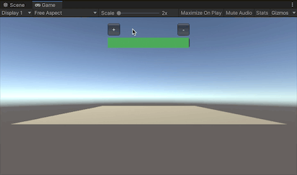

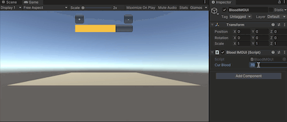

### UGUI

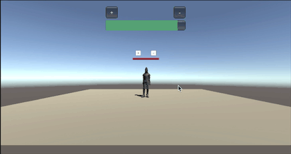

实验运行视频地址：[传送门](https://www.bilibili.com/video/bv17z4y1C7qa)

## 实验 Assets 结构

本次实验的 `Assets` 结构如下图所示：

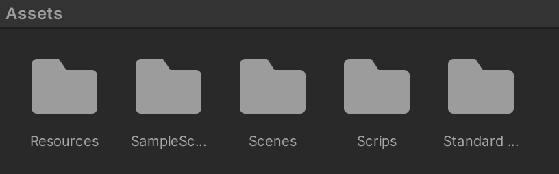

- `Resources`：本次实验中用到的资源，里面包括两个文件夹 `color` 和 `Prefabs`

  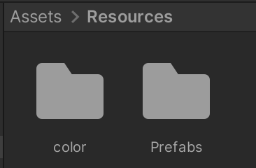

  - `color`：存放了在制作 `IMGUI` 的时候用到的纯颜色图片

    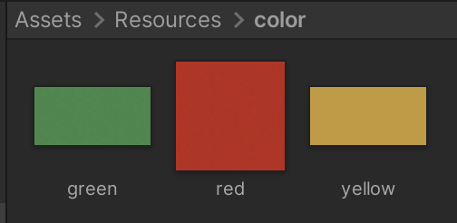

  - `Prefabs`：存放了本次通过 `IMGUI` 和 `UGUI` 做好的血条的预制

    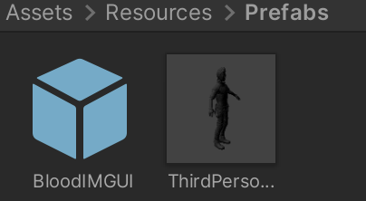

- `SampleScenes`：官方资源库

- `Scenes`：本次实验用到的场景，可以通过点击这个场景运行本次实验

- `Scrips`：本次实验中用到的代码， `IMGUI` 和 `UGUI` 分别用了一个代码来编写

  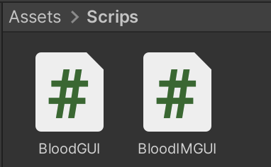

- `Standard Assets`：官方资源库

## 实验过程

### IMGUI

看了往届学长的作品，几乎都是使用灰色作为血条的显示颜色，我觉得这样可能实现起来并不像一个血条的显示，所以基于拳皇等各种游戏的经验，我选择使用渐变色来代替之前的灰色的血条，这样看起来也更加的美观。

但是这样问题就出现了，就不能像普通的滚动条一样增加背景颜色，于是想到了用 `Button` 来模拟血条，然后设置 `Button` 在不同的血量值显示不同的大小，并且有不同的背景颜色，这样就可以完美解决这个问题，实现的代码如下：

```c#
using UnityEngine;
public class BloodIMGUI : MonoBehaviour
{
    private Rect pos; // 血条显示的位置
    private Texture2D green, yellow, red; // 血条渐变的背景颜色
    private float preBlood; // 之前的血量
    public float curBlood; // 当前的血量
    
    void Start()
    {
        // 将颜色赋值
        yellow = Resources.Load<Texture2D>("color/yellow");
        green = Resources.Load<Texture2D>("color/green");
        red = Resources.Load<Texture2D>("color/red");
        // 设置位置
        pos = new Rect(Screen.width/2 - 100, 50, 200, 25);
        curBlood = preBlood = 90;
    }

    void OnGUI()
    {
        GUIStyle style = new GUIStyle();
        GUI.Button(pos, "");
        // 不同数值设置不同的血量
        if (curBlood >= 80) style.normal.background = green;
        else if (curBlood <= 20) style.normal.background = red;
        else style.normal.background = yellow;
        
        // 使得血量变化更加流畅
        preBlood = Mathf.Lerp(preBlood, curBlood, 0.1f);
        GUI.Button(new Rect(pos.position.x, pos.position.y, preBlood / 100 * pos.size.x, pos.size.y), "", style);
    }
}
```

要使代码成功显示在场景中需要创建一个空的游戏对象，我将此游戏对象命名为 `BloodIMGUI`，然后将写好的代码拖到该游戏对象上点击运行即可成功显示。

由上面的代码可以看到我设置了一个 `public` 属性的变量为当前的血量值，只要改变它即可在运行中看到血条的变化：

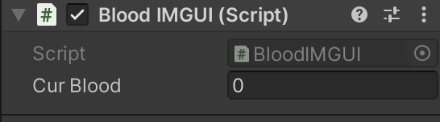


但是这样会显得比较麻烦，所以为了方便的进行增加和减少血量，我又在血条的上方设置了加号和减号的按钮，这样点击加号就会增加血量，点击减号就会减少血量，实现出来的效果如下图所示：

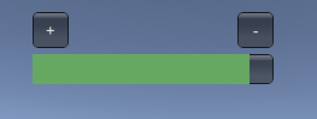

但是这时出了一个小问题就是如果一直按加号的话血量可能就会溢出也就是超过底部的 `Button`，如下图：

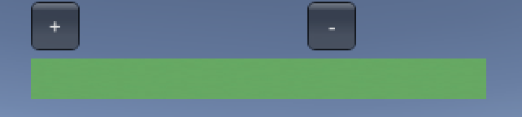

所以这个时候需要加一个限制，就是血量值如果太高的话超过最大血量值就不再允许增加，实现出来的代码如下：

```c#
using UnityEngine;
public class BloodIMGUI : MonoBehaviour
{
    private Rect pos; // 血条显示的位置
    private Texture2D green, yellow, red; // 血条渐变的背景颜色
    private float preBlood; // 之前的血量
    private int isChange; // 判断是否按了按钮
    // 增加或减少的按钮
    private Rect btn1;
    private Rect btn2;
    public float curBlood; // 当前的血量
    
    void Start()
    {
        // 将颜色赋值
        yellow = Resources.Load<Texture2D>("color/yellow");
        green = Resources.Load<Texture2D>("color/green");
        red = Resources.Load<Texture2D>("color/red");
        // 设置位置
        pos = new Rect(Screen.width/2 - 100, 50, 200, 25);
        curBlood = preBlood = 90;
        // 设置按钮位置
        btn1 = new Rect(Screen.width / 2 - 100, 15, 30, 30);
        btn2 = new Rect(Screen.width / 2 + 70, 15, 30, 30);

        isChange = 0;
    }

    void OnGUI()
    {
        // 控制血条的按钮
        if (GUI.Button(btn1, " + ")) isChange = 1;
        if (GUI.Button(btn2, " - ")) isChange = 2;

        if (isChange == 1){
            curBlood = curBlood + 10 > 100 ? 100 : curBlood + 10;
            isChange = 0;
        }
        else if (isChange == 2){
            curBlood = curBlood - 10 < 0 ? 0 : curBlood - 10;
            isChange = 0;
        }

        GUIStyle style = new GUIStyle();
        GUI.Button(pos, "");
        // 不同数值设置不同的血量
        if (curBlood >= 80) style.normal.background = green;
        else if (curBlood <= 20) style.normal.background = red;
        else style.normal.background = yellow;
        
        // 使得血量变化更加流畅
        preBlood = Mathf.Lerp(preBlood, curBlood, 0.1f);
        GUI.Button(new Rect(pos.position.x, pos.position.y, preBlood / 100 * pos.size.x, pos.size.y), "", style);
    }
}
```

实现出来的效果也是我们想要的，点击加号就会增加血量点击减号就会减少血量且不会超过底部的 `Button` :

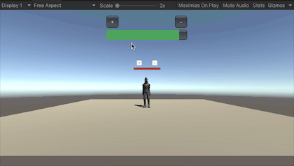

### UGUI

使用 UGUI 制作血条，老师的博客中讲解的已经很详细，这里也是按照自己的理解进行实验步骤：

- 首先需要导入标准资源库，用来导入本次实验需要的人物模型，选择菜单栏中的 `Windows` 中的 `package Manager` ，点击标准资源库然后导入，将里面的人物模型拖到界面中即可

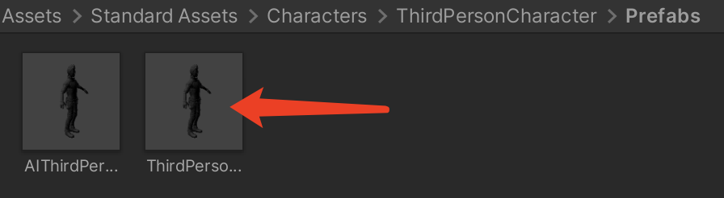

- 创建好人物模型后，需要在该人物模型上添加 `Canvas` 子对象，然后选择刚刚添加好的 `Canvas` 在上面添加 `Slider` 子对象，目的是添加滑条作为血条的子对象

- 展开 `Slider`

  - 选择 `Handle Slider Area`，禁灰（disable）该元素
  - 选择 `Background`，禁灰（disable）该元素
  - 选择 `Fill Area` 的 `Fill`，修改 Image 组件的 Color 为 红色

  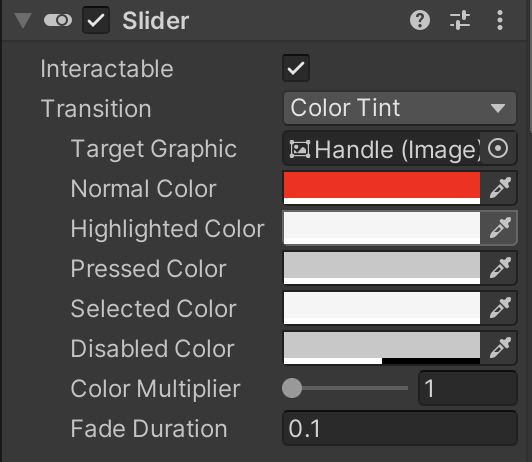

- 选择 `Slider` 的 `Slider`组件

  - 设置 `MaxValue` 为 100
  - 设置 `Value` 为 100

  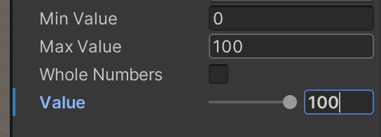

- 该血条我选择实现和上面的血条有一样的效果，所以多加了两个按钮分别为 `btn1` 和 `btn2`，分别控制人物血量的多少，最后人物的整体结构层次如下：

  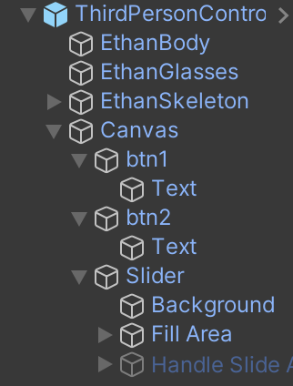

  该按钮需要通过代码挂载到 `Canvas`，该代码就是实现了简单的血条的增加和减少，并且限制了血条无法超出限制：

  ```c#
  using System.Collections;
  using System.Collections.Generic;
  using UnityEngine;
  using UnityEngine.UI;
  
  public class BloodGUI : MonoBehaviour {
      private float preBlood = 0f;
      private float curBlood = 0f;
      GameObject btn1, btn2;
      public Slider bloodBar;
  
      private void Start() {
          btn1 = GameObject.Find("btn1"); Button a = btn1.GetComponent<Button>();
          btn2 = GameObject.Find("btn2"); Button b = btn2.GetComponent<Button>();
          // 添加代理事件
          a.onClick.AddListener(delegate () {
              this.OnClick(btn1);
          });
          b.onClick.AddListener(delegate () {
              this.OnClick(btn2);
          });
      }
  
      private void OnClick(GameObject sender) {
          if (sender.name == "btn1") curBlood = curBlood - 10f < 0f ? 0f : curBlood - 10f;
          if (sender.name == "btn2") curBlood = curBlood + 10f > 100f ? 100f : curBlood + 10f;
      }
  
      void Update() {
          // 使血条更加平滑
          preBlood = Mathf.Lerp(preBlood, curBlood, 0.1f);
          bloodBar.value = preBlood;
          transform.rotation = Quaternion.LookRotation(Vector3.forward);
      }
  }
  ```

  最后实现出来的效果也是比较令我满意，如下：

  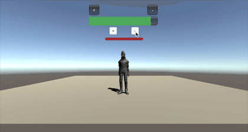

## 优缺点比较

进行完了对比实验，二者实现起来的优缺点对比还是比较明显的，在此详细分析一下：

### IMGUI

**优点**：

- 新手 UI 入门容易，帮助新手理解引擎的游戏循环
- 高级程序员，创建在线调试环境
- 工具开发者，定义 Unity 新的编程工具
- IMGUI 符合游戏编程的传统
- 在修改模型，渲染模型等编程模式中，在渲染阶段之后，绘制 UI 界面非常美观
- 避免了 UI 元素始终在屏幕前面，能有较好的执行效率，一切都控制掌握在程序员的手中，对于存储资源贫乏的设备有更好的效果

**缺点**：

- 很难进行调试，因为没有用于玩家可能使用并与之交互的普通游戏内用户界面
- 传统的代码，效率比较低下
- 不支持可视化

### UGUI

**优点**：

- 所见即所得设计工具，支持可视化
- 支持多模式、多摄像机渲染
- 面向对象
- UI 元素和场景可以融为一体进行交互

**缺点**：

- 上手难度较高，需要用较多的时间去进行学习
- 对于复杂的项目，可能需要创建很多的 `Canvas` ，因此项目会变的更加复杂，不易操作

## 预制的使用方法

我在场景中已经放置好了本次实验的预制直接运行即可

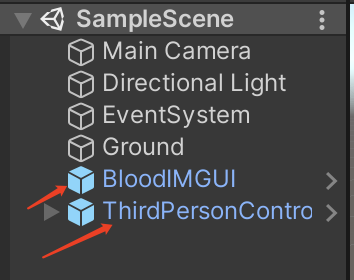

在 `Assets/Resources/Prefabs` 此路径下也保存了本次实验使用到的预制，直接拖放到场景中即可正常运行，查看效果

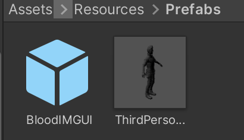