# AI 坦克设计

## 个人信息

| 课程名称 | 3D游戏编程与设计 |   任课老师   |      潘茂林      |
| :------: | :--------------: | :----------: | :--------------: |
|   年级   |      2018级      | 专业（方向） |   软件工程专业   |
|   学号   |     18342025     |     姓名     |      胡鹏飞      |
|   电话   |   13944589695    |    Email     | 945554668@qq.com |

## 作业要求

从商店下载游戏：`Kawaii Tank` 或 其他坦克模型，构建 AI 对战坦克。具体要求

- 使用“感知-思考-行为”模型，建模 AI 坦克
- 场景中要放置一些障碍阻挡对手视线
- 坦克需要放置一个矩阵包围盒触发器，以保证 AI 坦克能使用射线探测对手方位
- AI 坦克必须在有目标条件下使用导航，并能绕过障碍。（失去目标时策略自己思考）
- 实现人机对战

## 游戏设计

### 游戏说明

玩家通过键盘上的 `wsad` 按键来控制坦克的移动，游戏场景是坦克（青蓝色）第一视角的，地图中会散落一些敌方坦克（白色），如果暴露在地方坦克的视野中，他们就会跟踪玩家，并且向我们发射子弹，我们要尽可能躲避子弹，并且可以按空格键进行反击。每个坦克都有自己的生命值，如果生命值低于 `0` 则会被销毁，当然玩家的坦克被销毁，游戏结束！

### 游戏截图和视频

- 游戏地图展示：

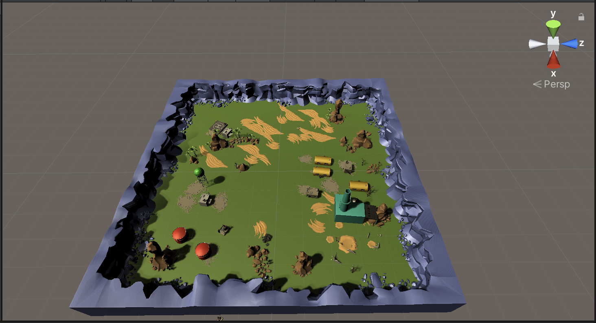

- 游戏运行过程：

  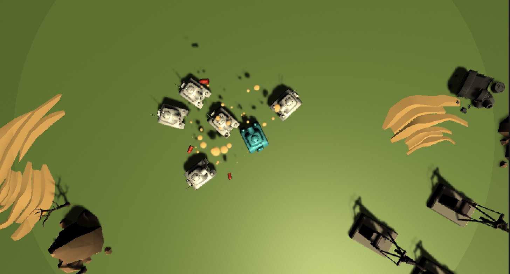

- 游戏结束：

  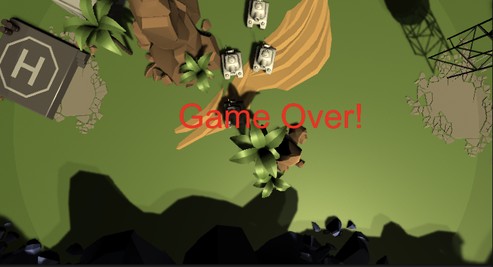

- **视频地址**：[传送门](https://www.bilibili.com/video/BV1zK411g73C)

### 博客地址

[传送门](https://blog.csdn.net/qq_43267773/article/details/111933989)

### 游戏运行说明

将 `Assets` 文件夹下载到本地，然后直接通过 `unity` 打开该文件即可成功运行，或者新建个项目，用该 `Assets` 文件夹覆盖原有的，打开后即可正常运行

### 游戏资源获取

在 `Asset Store` 下载 `tanks tutorial` 资源：

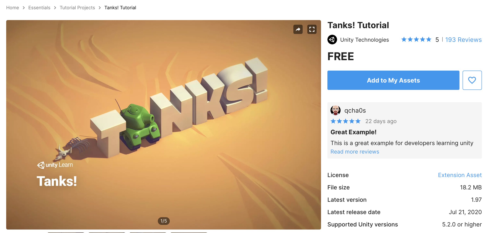

### 游戏 Assets 结构

项目的 `Assets` 结构如下所示：

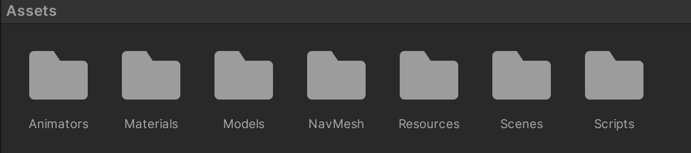

- `Animators`：存放了本次实验的动作状态机：

  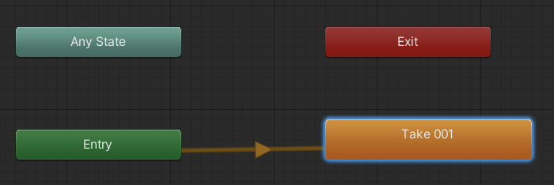

- `Materials`：存放本次实验地图上的预制的颜色物体：

  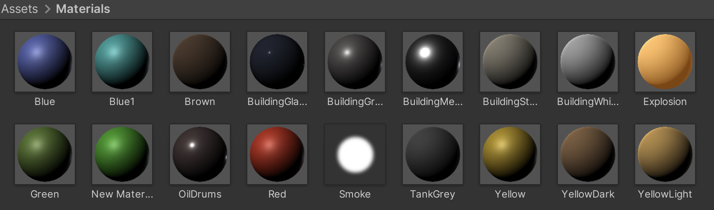

- `Models`：本次实验中地图上的各个组件的模型

  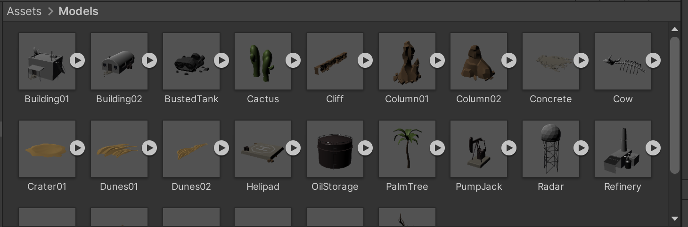

- `NavMesh`：生成的自动寻路算法

  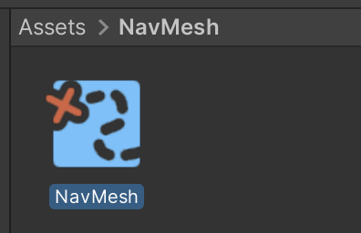

- `Resources`：存放了本次实验的资源，路径下有两个子路径

  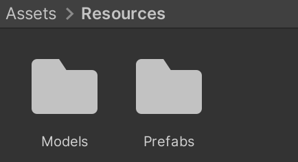

  - `Models`：存放了本次实验用到的坦克和子弹的模型，以及 `Materials` 中颜色的设置：

    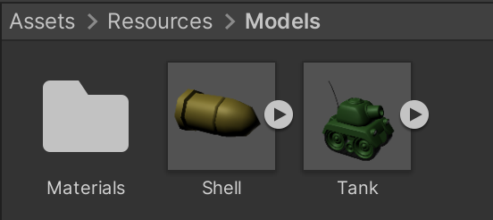

  - `Prefabs`：存放了本次实验中的预制，包括子弹，地图，敌方和玩家的坦克，以及子弹和坦克的爆炸的效果：

    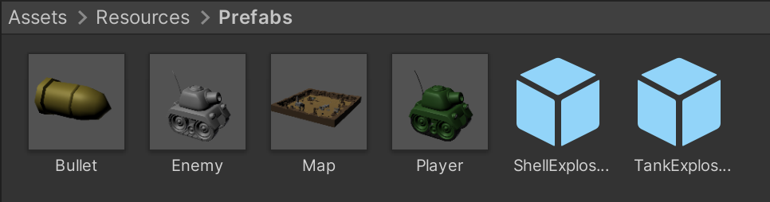

    - 玩家坦克：

      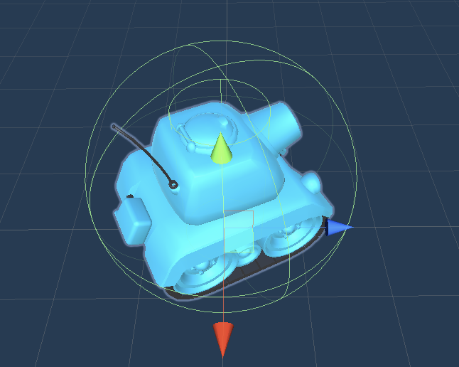

    - 敌方坦克：

      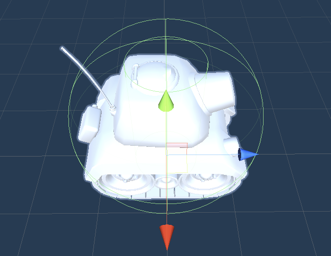

    - 子弹：

      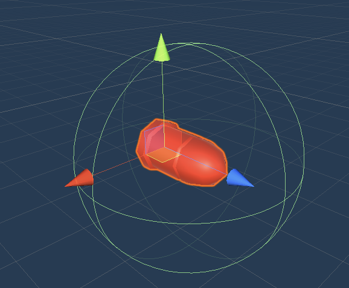

    - 地图：

      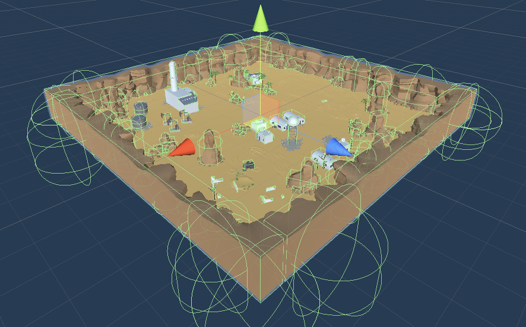

- `Scenes`：保存了游戏的场景以及灯光的设置，双击 `Main` 进入到此场景点击运行就可以运行游戏：

  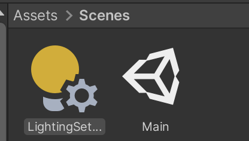

- `Scripts`：存储本次游戏的代码文件，实现了工厂模式生产坦克，单实例模式：

  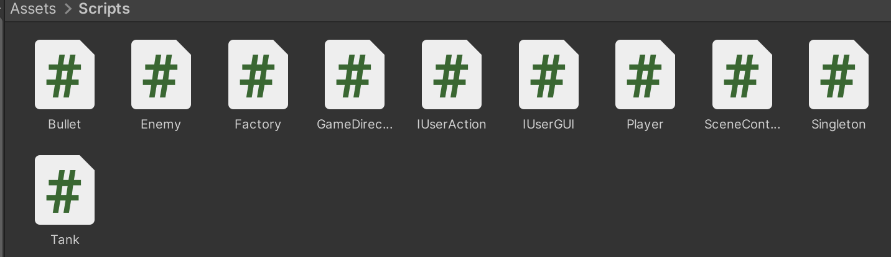

### 要求实现

本次实验的游戏设计要求，会在代码实现的部分进行详细说明；一些场景方面的设置，上面的截图已经展现出来，玩法方面也实现了人机对战。

**新功能实现**：

- 更加美观的场景
- 第一人称视角进行游戏
- 攻击判定方式，并不是子弹打中，而是根据子弹爆炸的范围来判定伤害

### 代码实现

#### Bullet

该代码文件实现了子弹的相关设计，设置了子弹的爆炸范围，从而设置不同的伤害；对于不同类型的坦克（己方坦克，敌方坦克）会有不同的伤害；

```c#
using System.Collections;
using System.Collections.Generic;
using UnityEngine;

// 子弹设置 √
public class Bullet : MonoBehaviour {
    // 设置爆炸范围
    public float range = 3.0f;
    private TankType tankType;

    // 设置坦克的类型
    public void setTankType (TankType type) {
        tankType = type;
    }

    // 设置碰撞事件
    private void OnCollisionEnter (Collision collision) {
        // 打到自己不算
        if (collision.transform.gameObject.tag == "Enemy" && this.tankType == TankType.ENEMY ||
            collision.transform.gameObject.tag == "Player" && this.tankType == TankType.PLAYER)
            return;

        Factory factory = Singleton<Factory>.Instance;
        ParticleSystem explosion = factory.getParticleSystem ();
        explosion.transform.position = gameObject.transform.position;

        // 爆炸范围内的所有物体都受到伤害
        Collider[] colliders = Physics.OverlapSphere (gameObject.transform.position, range);

        foreach (var collider in colliders) {
            // 设置范围伤害
            float dis = Vector3.Distance (collider.transform.position, gameObject.transform.position);
            float damage;

            // 玩家和敌人设置不同的伤害
            if (collider.tag == "Enemy" && this.tankType == TankType.PLAYER) {
                damage = 50.0f / dis;
                collider.GetComponent<Tank> ().setHP (collider.GetComponent<Tank> ().getHP () - damage);
            } else if (collider.tag == "Player" && this.tankType == TankType.ENEMY) {
                damage = 20.0f / dis;
                collider.GetComponent<Tank> ().setHP (collider.GetComponent<Tank> ().getHP () - damage);
            }

            explosion.Play ();
        }
        if (gameObject.activeSelf) factory.recycleBullet (gameObject);
    }
}
```

并且需要挂载到子弹上

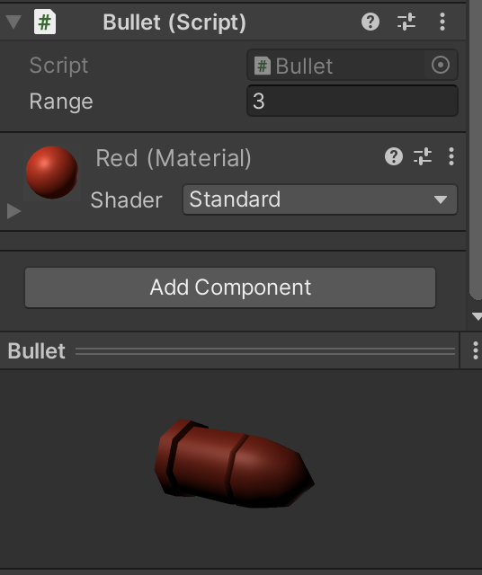

#### Enemy

该代码文件实现了敌人坦克的设置。由于用到了工厂模式，所以在坦克被销毁的时候需要进行回收；并且实现了 AI 功能，启动了协程，控制坦克的运动和射击操作；

```c#
private void Start () {
        playerPos = GameDirector.getInstance ().currentSceneController.getPlayer ().transform.position;
        // 启动协程
        StartCoroutine (shoot ());
    }
// 控制射击
    IEnumerator shoot () {
        while (!gameover) {
            for (float i = 1; i > 0; i -= Time.deltaTime) yield return 0;

            // 射程
            if (Vector3.Distance (playerPos, gameObject.transform.position) < 10) shoot (TankType.ENEMY);
        }
    }
```

并且在坦克看到玩家的时候会进行跟踪移动，然后在射程范围内进行攻击：

```c#
void Update () {
  playerPos = GameDirector.getInstance ().currentSceneController.getPlayer ().transform.position;
  gameover = GameDirector.getInstance ().currentSceneController.GameOver ();
  if (!gameover) {
    if (getHP () <= 0 && recycleEnemy != null) recycleEnemy (this.gameObject);
    else {
      // 向玩家移动
      NavMeshAgent agent = gameObject.GetComponent<NavMeshAgent> ();
      agent.SetDestination (playerPos);
    }
  } else {
    // 游戏结束后停止运动
    NavMeshAgent agent = gameObject.GetComponent<NavMeshAgent> ();
    agent.velocity = Vector3.zero;
    agent.ResetPath ();
  }
}
```

并且需要挂载到地方坦克上

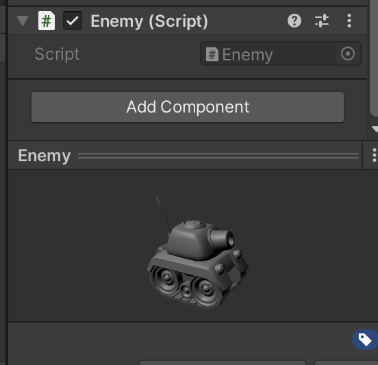

#### Factory

该代码文件实现了工厂模式，来生产和销毁坦克和子弹；主要设计了初始化游戏物体；生产坦克，生产子弹；回收坦克，回收子弹

```c#
using System.Collections;
using System.Collections.Generic;
using UnityEngine;

public enum TankType { PLAYER, ENEMY }

// 工厂模式
public class Factory : MonoBehaviour {

    public GameObject player;
    public GameObject enemy;
    public GameObject bullet;
    public ParticleSystem explosion;

    private List<GameObject> usedTanks;
    private List<GameObject> freeTanks;
    private List<GameObject> usedBullets;
    private List<GameObject> freeBullets;

    private GameObject player_t;
    private List<ParticleSystem> particles;

    // 初始化
    private void Awake () {
        usedTanks = new List<GameObject> ();
        freeTanks = new List<GameObject> ();
        usedBullets = new List<GameObject> ();
        freeBullets = new List<GameObject> ();
        particles = new List<ParticleSystem> ();

        player_t = GameObject.Instantiate<GameObject> (player) as GameObject;
        player_t.SetActive (true);
        player_t.transform.position = Vector3.zero;
    }

    void Start () { Enemy.recycleEnemy += recycleEnemy; }

    // 获取玩家
    public GameObject getPlayer () {return player_t;}

    // 获取敌人
    public GameObject getEnemys () {
        GameObject newT = null;
        if (freeTanks.Count <= 0) {
            newT = GameObject.Instantiate<GameObject> (enemy) as GameObject;
            usedTanks.Add (newT);
            newT.transform.position = new Vector3 (Random.Range (-100, 100), 0, Random.Range (-100, 100));
        } else {
            newT = freeTanks[0];
            freeTanks.RemoveAt (0);
            usedTanks.Add (newT);
        }

        newT.SetActive (true);
        return newT;
    }

    // 获取子弹
    public GameObject getBullets (TankType type) {
        GameObject newBullet;
        if (freeBullets.Count <= 0) {
            newBullet = GameObject.Instantiate<GameObject> (bullet) as GameObject;
            usedBullets.Add (newBullet);
            newBullet.transform.position = new Vector3 (Random.Range (-100, 100), 0, Random.Range (-100, 100));
        } else {
            newBullet = freeBullets[0];
            freeBullets.RemoveAt (0);
            usedBullets.Add (newBullet);
        }

        newBullet.GetComponent<Bullet> ().setTankType (type);
        newBullet.SetActive (true);
        return newBullet;
    }

    // 获取粒子系统
    public ParticleSystem getParticleSystem () {
        foreach (var particle in particles){
            if (!particle.isPlaying) return particle;
        }

        ParticleSystem newT = GameObject.Instantiate<ParticleSystem> (explosion);
        particles.Add (newT);
        return newT;
    }

    // 回收坦克
    public void recycleEnemy (GameObject enemyTank) {
        usedTanks.Remove (enemyTank);
        freeTanks.Add (enemyTank);
        enemyTank.GetComponent<Rigidbody> ().velocity = Vector3.zero;
        enemyTank.SetActive (false);
    }

    // 回收子弹
    public void recycleBullet (GameObject Bullet) {
        usedBullets.Remove (Bullet);
        freeBullets.Add (Bullet);
        Bullet.GetComponent<Rigidbody> ().velocity = Vector3.zero;
        Bullet.SetActive (false);
    }
}
```

#### GameDirector

该代码文件实现了总导演的设计，主要是得到实例化

```c#
using System.Collections;
using System.Collections.Generic;
using UnityEngine;

// 总导演 √
public class GameDirector : System.Object {
    private static GameDirector _instance;
    public SceneController currentSceneController { get; set; }

    private GameDirector () { }

    public static GameDirector getInstance () {
        if (_instance == null) _instance = new GameDirector ();

        return _instance;
    }
}
```

#### IUserAction

该代码文件实现了动作的接口；主要有控制玩家坦克的转动以及行进；控制射击；控制游戏是否结束：

```c#
using System.Collections;
using System.Collections.Generic;
using UnityEngine;

// 动作接口 √
public interface IUserAction {
    // 控制转动和行进
    void moveForWard ();
    void moveBackWard ();
    void turn (float turnX);
    // 控制射击
    void shoot ();
    // 控制游戏结束
    bool GameOver ();
}
```

#### IUserGUI

该代码文件实现了游戏界面的设置；主要是设计了监听键盘的输入，来控制坦克的行进以及攻击的操作；并且在游戏结束后显示 `Game Over!`

```c#
using System.Collections;
using System.Collections.Generic;
using UnityEngine;

// 设置界面 √
public class IUserGUI : MonoBehaviour {
    IUserAction action;

    void Start () {
        action = GameDirector.getInstance ().currentSceneController as IUserAction;
    }

    void Update () {
        if (!action.GameOver ()) {
            // 监听键盘
            if (Input.GetKey (KeyCode.W)) action.moveForWard ();
            if (Input.GetKey (KeyCode.S)) action.moveBackWard ();
            if (Input.GetKeyDown (KeyCode.Space)) action.shoot ();
            float turnX = Input.GetAxis ("Horizontal");

            action.turn (turnX);
        }
    }

    void OnGUI () {
        // 游戏结束
        if (action.GameOver ()) {
            GUIStyle font = new GUIStyle ();
            font.fontSize = 50;
            font.normal.textColor = Color.red;
            GUI.Label (new Rect (Screen.width / 2 - 100, Screen.height / 2 - 50, 200, 50), "Game Over!", font);
        }
    }
}
```

#### Player

该代码文件实现了玩家的设计；设置了一个代理事件，主要控制玩家坦克被销毁；设置了玩家坦克初始的生命值；当坦克的生命值低于0则被销毁；控制坦克的移动；控制坦克的左右转向

```c#
using System.Collections;
using System.Collections.Generic;
using UnityEngine;

// 玩家设置 √
public class Player : Tank {
    // 玩家坦克被摧毁
    public delegate void DestroyPlayer ();
    public static event DestroyPlayer destroyEvent;

    // 设置初始生命值
    void Start () { setHP (100); }

    void Update () {
        if (getHP () <= 0) {
            this.gameObject.SetActive (false);
            destroyEvent ();
        }
    }

    // 前后方向移动
    public void moveForWard () {
        gameObject.GetComponent<Rigidbody> ().velocity = gameObject.transform.forward * 20;
    }
    public void moveBackWard () {
        gameObject.GetComponent<Rigidbody> ().velocity = gameObject.transform.forward * (-20);
    }

    // 实现左右转向
    public void turn (float turnX) {
        float x = gameObject.transform.localEulerAngles.x;
        float y = gameObject.transform.localEulerAngles.y + turnX * 2;
        gameObject.transform.localEulerAngles = new Vector3 (x, y, 0);
    }
}
```

并且需要挂载到玩家坦克上

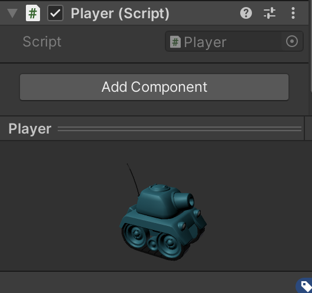

#### SceneController

该代码文件实现了场景控制器。用来生产玩家和敌人；并且实现了第一视角的设置，将相机的位置始终跟随玩家；可以获取玩家的物体；控制玩家进行移动；控制玩家进行设计；返回游戏的状态并且可以设置游戏的状态

```c#
using System.Collections;
using System.Collections.Generic;
using UnityEngine;

// 场景控制器 √
public class SceneController : MonoBehaviour, IUserAction {
    public GameDirector director;
    public GameObject player;

    private Factory myFactory;
    private GameObject[] enemies;
    private int enemyCount = 5;
    private bool gameOver = false;

    // 初始化
    private void Awake () {
        director = GameDirector.getInstance ();
        director.currentSceneController = this;

        myFactory = Singleton<Factory>.Instance;
        enemies = new GameObject[enemyCount];

        gameOver = false;
    }

    // 生产玩家和敌人 
    void Start () {
        player = myFactory.getPlayer ();
        for (int i = 0; i < enemyCount; ++i) enemies[i] = myFactory.getEnemys ();
        Player.destroyEvent += setGameOver;
    }

    // 设置相机的位置
    void Update () {
        Camera.main.transform.position = new Vector3 (player.transform.position.x, 20, player.transform.position.z);
    }

    // 获取玩家游戏物体
    public GameObject getPlayer () { return player; }

    // 控制玩家移动
    public void moveForWard () { player.GetComponent<Player> ().moveForWard (); }
    public void moveBackWard () { player.GetComponent<Player> ().moveBackWard (); }
    public void turn (float turnX) { player.GetComponent<Player> ().turn (turnX); }

    // 控制玩家射击
    public void shoot () { player.GetComponent<Player> ().shoot (TankType.PLAYER); }

    // 返回游戏状态
    public bool GameOver () { return gameOver; }
    // 游戏结束
    public void setGameOver () { gameOver = true; }
}
```

并且需要连同 `IUserGUI` 和 `Factory` 一同挂载到相机上

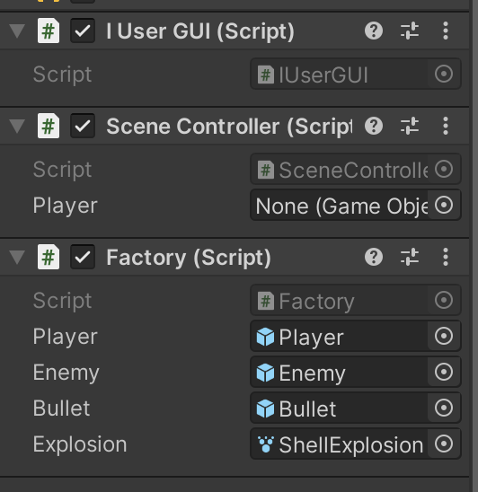

#### Singleton

该代码文件实现了单实例模式

```c#
using System.Collections;
using System.Collections.Generic;
using UnityEngine;

// 场景单实例模式 √
public class Singleton<T> : MonoBehaviour where T : MonoBehaviour {
    protected static T instance;
    public static T Instance {
        get {
            if (instance == null) instance = (T) FindObjectOfType (typeof (T));

            return instance;
        }
    }
}
```

#### Tank

该代码文件实现了坦克的相关属性；主要设置了坦克初始的生命值为100；并且设置了 `get/set` 方法。以及设置被攻击后生命值的减少；射击子弹射击的方向以及力度：

```c#
using System.Collections;
using System.Collections.Generic;
using UnityEngine;

// 设置坦克相关属性 √
public class Tank : MonoBehaviour {
    private float health = 100.0f;

    // 初始化生命值
    public Tank () { health = 100.0f; }

    // 设置/获取生命值
    public void setHP (float health) { this.health = health; }
    public float getHP () { return health; }

    // 被攻击
    public void Attacked () { health -= 20; }

    // 设置子弹射击
    public void shoot (TankType type) {
        GameObject bullet = Singleton<Factory>.Instance.getBullets (type);

        // 设置子弹射的方向
        bullet.transform.position = new Vector3 (transform.position.x, 1.5f, transform.position.z) + transform.forward * 1.5f;
        bullet.transform.forward = transform.forward;
        bullet.GetComponent<Rigidbody> ().AddForce (bullet.transform.forward * 20, ForceMode.Impulse);
    }
}
```

## 实验总结

本次实验的工作量较大，需要设计的东西有很多，学会了 AI 智能设计，并且将多种模式融合在一起进行编写游戏，收获很多。

本次是最后一次实验作业了，在本门课程中学到了很多设计模式，以及游戏编程的方法，也十分感谢 TA 和老师的付出！